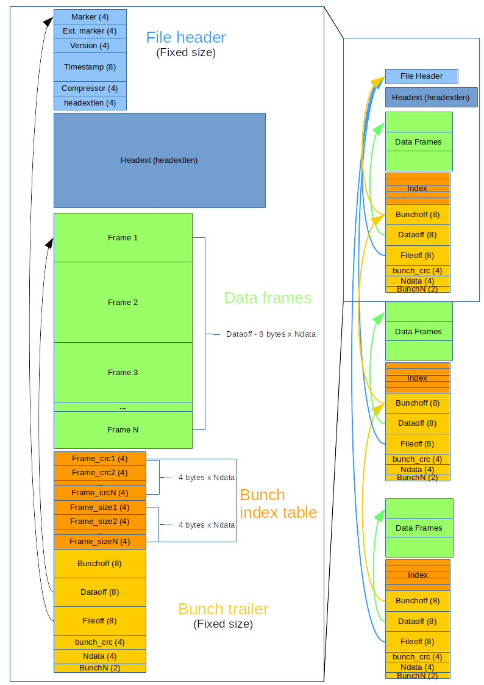

===========
Data and IO
===========

This section presents the classes used to read and write data
that is acquired by the SSDAQ system. Data is written using two file
formats; slow signal data received from the camera is written to hard
drive using the `hdf5` fileformat, while all other data use the custom
`indexed container format` (icf) using their on wire formats for serialization.

In general, to read data the :class:`~ssdaq.data.io.DataReader` handles all data except for
slow signal data which can be read using :class:`~ssdaq.data.io.SSDataReader`.

ssdaq.data.io
=============

.. autoclass:: ssdaq.data.io.DataReader
    :members:
    :inherited-members:

.. autoclass:: ssdaq.data.io.SSDataReader
    :members:

.. autoclass:: ssdaq.data.io.SSDataWriter
    :members:

ssdaq.core
==========

.. autoclass:: ssdaq.core.io.RawObjectWriterBase
    :members:

.. autoclass:: ssdaq.core.io.RawObjectReaderBase
    :members:

Fileformat Protocols
^^^^^^^^^^^^^^^^^^^^
Both the custom protocols used by the :class:`~ssdaq.core.io.RawObjectWriterBase` and
:class:`~ssdaq.core.io.RawObjectReaderBase` are indexed containers meaning that they just
provide the framework and file format to index objects that are written to file. Methods of
serializing and deserializing the objects must be provided to these classes.

protocol 0
----------
This protocol provides a basic format for indexing objects. However, it has limitations
as there is no efficient way of compressing the data saved in this format unless the whole
file is compressed. The protocol is defined as::

    Data chunks of serialized data are
    sequentially writter to file, with
    each chunk being prepended with:
    chunk length in bytes (4 bytes)
    and a crc32 hash      (4 bytes)

    The file header is 24 bytes long and has the following layout

        bytes:      field:
        0-7         Custom field for file format specifications (set by the header parameter)
        8-11        Protocol version
        12-15       Not used
        16-19       Not used
        20-23       Not used

    General file structure:
        +-------------+
        | File Header |
        +-------------+
        | Chunk Header|
        +-------------+
        |     Data    |
        +-------------+
        | Chunk Header|
        +-------------+
        |     Data    |
        +-------------+
              ...
              ...

protocol 1
----------
Protocol 1 is more complicated than protocol 0 as it supports compression,
includes a filecreation timestamp (redundancy of the unix timestamp which can be
accidentally changed while copying) and an extendible header which can be used by
custom formats to store meta-data. The protocol is defined as:

Code structure
==============

.. inheritance-diagram:: ssdaq.data._ioimpl
   :parts: 1

